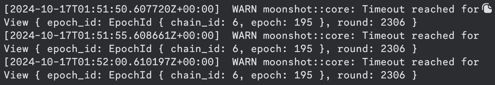

# NodeOps-Support-FAQ

This document is created to support node operators, with their issue, and solutions they can administer before reaching out for support.

Some errors are peculiar with 

  
Blocks are frozen

    
    <h4>Description</h4>
    epoch and round are stuck in a particular number
  

